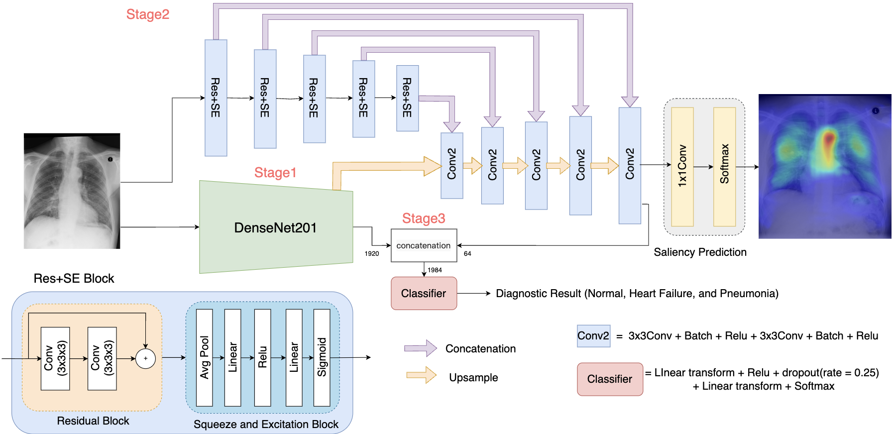
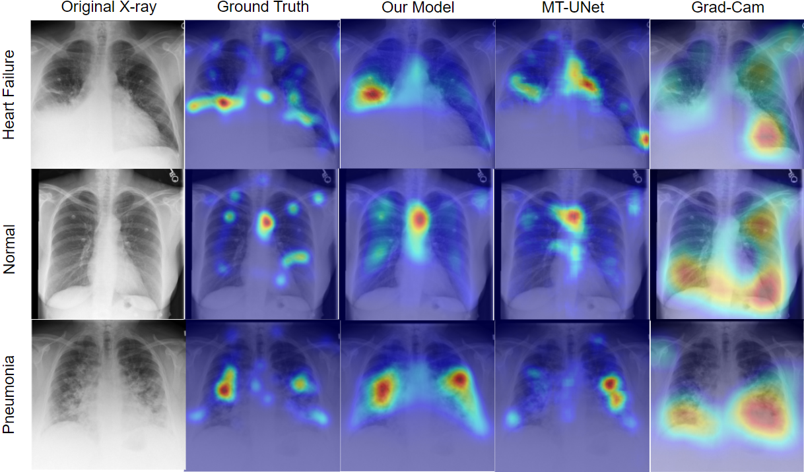

# Cooperative Learning

<p>
    
    
</p>

Please cite the following paper if you are using our model.
Qiu Z, Rivaz H, Xiao Y. [Joint enhancement of automatic chest x-ray diagnosis and radiological gaze prediction with multistage cooperative learning](https://aapm.onlinelibrary.wiley.com/doi/10.1002/mp.17977). Med Phys. 2025 Jul;52(7):e17977. doi: 10.1002/mp.17977. PMID: 40665596; PMCID: PMC12264402.

## Installation

### Data
You can download the two datasets used in this study from the following links:
1) [MIMIC-CXR Database](https://physionet.org/content/mimic-cxr/1.0.0/)
   - Contains the chest X-ray images.
   - Access requires approval through PhysioNet Credentialed Access.
2) [Eye Gaze Data for Chest X-rays](https://physionet.org/content/ct-ich/1.3.1/)
   - Provides eye gaze data for chest X-ray studies.
   - Includes references to specific chest X-ray images from the MIMIC-CXR database.

## Important Note: Image Matching

The eye gaze data references specific chest X-ray images from the MIMIC-CXR database. You need to manually locate and download these images from the MIMIC-CXR database **one by one** based on the image IDs provided in the Eye Gaze dataset.

## Environment Setup

To set up the environment for this project, follow these steps:

### Step 1: Clone the Repository

First, clone this repository to your local machine:

```bash
git clone https://github.com/HealthX-Lab/CXRGazeLearn.git
cd CXRGazeLearn
```
### Step 2: Install Required Packages

Install the required packages using **requirements.txt**:

```bash
pip install -r requirements.txt
```

## Dataset Processing

To process the dataset, follow these steps:

### Step 1: Navigate to the Data Folder

Go to the `Data` folder in the project directory:

```bash
cd Data
```

### Step 2: Update the Directory Paths

Open `data.py` and update the paths to your local directories for the datasets. Replace the placeholder paths with your own:

```python
gaze_path = '/home/ziruiqiu/MscStudy/eye-gaze-dataset/physionet.org/files/egd-cxr/1.0.0'  # Replace with your own path
cxr_path = '/home/ziruiqiu/MscStudy/eye-gaze-dataset'  # Replace with your own path
```

### Step3: Run the Data Processing Script

Execute the `data.py` script to process the dataset:

```bash
python data.py
```

## Code Usage

To use the code, follow these steps. Each stage corresponds to a step in the pipeline described in the paper.

### Step 1: Stage 1 - DenseNet-201 Feature Encoder

Navigate to the `CL` folder, which contains the code for training the DenseNet-201 feature encoder.

```bash
cd CL
python RUN.py
```
---
### Step 2: Stage 2 - Visual Saliency Map Prediction

The second stage generates visual saliency maps that mimic the attention patterns of medical professionals.

```bash
cd ..
cd Classification
python RUN.py
```
---

### Step 3: Stage 3 - Multi-Scale Feature-Fusion Classifier

The final stage performs the classification task using a feature-fusion approach:

```bash
cd ..
cd KL
python RUN.py
```

---


If you are unable to run the code, feel free to reach out [leoqiuzirui@gmail.com](leoqiuzirui@gmail.com) 
